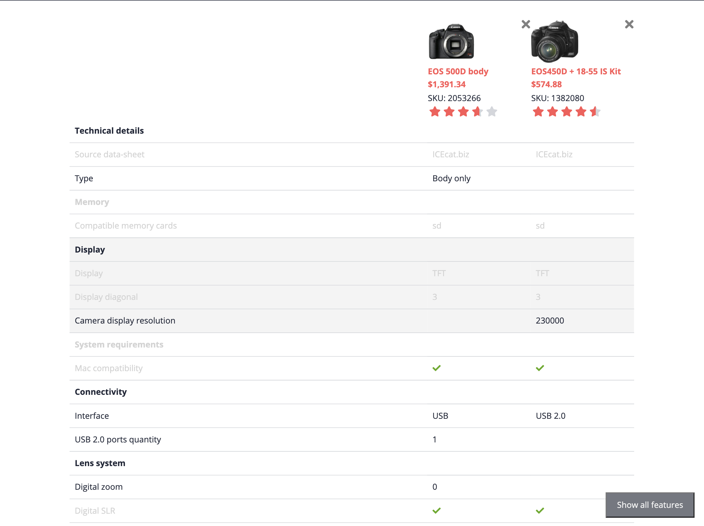

# CX260 - Project "Spartacus" Storefront for SAP Commerce Cloud: Status and Plans

## Description

This repository contains the material for the SAP TechEd 2020 session called CX260 - Project "Spartacus" Storefront for SAP Commerce Cloud.

## Overview

With the exercises in this session you'll gain how to develop a PWA storefront using the Spartacus libraries. You will setup a local Spartacus application and implement a customization on top of it. The customization will learn you various concepts and techniques.

## Come prepared!

For this session you need a local development system. Make sure you go through [the prerequisites](./prerequisites.md).

There are also a few other [recommendations](./prerequisites.md#recommendations) provided.

## Exercises

- [Exercise 1 – Setup Spartacus locally](exercises/exercise-1/README.md)
  - Exercise 1.1 Confirm prerequisites
  - Exercise 1.2 Create Angular application
  - Exercise 1.3 Install Spartacus
  - Exercise 1.4 Run Spartacus
- [Exercise 2 - Implement Product Comparison Selection](exercises/exercise-2/README.md)
  - Exercise 2.1 Generate files with the Angular CLI
  - Exercise 2.2 Add component to PDP
  - Exercise 2.3 Selection implementation
- [Exercise 3 - Implement Persistent Selection State](exercises/exercise-3/README.md)
  - Exercise 3.1 Toggle selection
  - Exercise 3.2 Persist selection
- [Exercise 4 - Comparison Page](exercises/exercise-4/README.md)
  - Exercise 4.1 Setup the CMS Comparison Content Page
  - Exercise 4.2 Add a link to the comparison page
- [Exercise 5 - Product Comparison Table](exercises/exercise-5/README.md)
  - Exercise 5.1 Scaffolding comparison table
  - Exercise 5.2 Add static CMS content
- [Exercise 6 - Product Comparison Header](exercises/exercise-6/README.md)
  - Exercise 6.1 Code scaffolding
  - Exercise 6.2 Implement component logic
  - Exercise 6.3 Implement view logic
  - Exercise 6.4 Add header
- [Exercise 7 - Comparison Features](exercises/exercise-7/README.md)
  - Exercise 7.1 Code scaffolding and importing
  - Exercise 7.2 ComparisonFeaturesService
  - Exercise 7.3 Implement comparison component (basic)
  - Exercise 7.4 Implement comparison component (advanced)

The end result of the exercises is a full blown product comparison feature, with the following UI:

## How to obtain support

Support for the content in this repository is available during the actual time of the online session for which this content has been designed. Otherwise, you may request support via the [Issues](../../issues) tab.

## License

Copyright (c) 2020 SAP SE or an SAP affiliate company. All rights reserved. This project is licensed under the Apache Software License, version 2.0 except as noted otherwise in the [LICENSE](LICENSES/Apache-2.0.txt) file.
