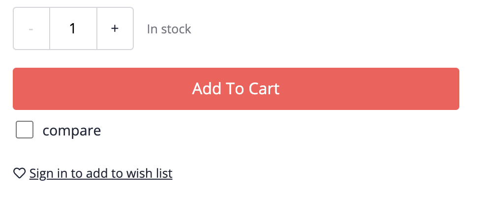

# Exercise 2 - Implement Product Comparison Selection

In this exercise, you will implement a checkbox that can be used to select a product for the comparison. The checkbox will be added to the Product Detail Page (PDP), underneath the add to cart button.



We're going to gradually generate and build the code in this exercise.

## Exercise 2.1 Generate files with the Angular CLI

In this exercise we're using the Angular CLI to generate files that host modules, components and services. We will start implementing in the next exercise.

### Step 1: Product Comparison Module

As we're planning to build multiple components and services for this feature, we'll wrap the code in a feature module. The feature module will be used as a single entry point to the feature, so that it can be conveniently added to the `AppModule`.

You can use the [Angular CLI to generate](https://angular.io/cli/generate) the feature module `ProductComparisonModule`, by running the following command:

```
ng g m product-comparison
```

(This is short for `ng generate module product-comparison`)

You should now manually add the newly created module in the import list of the application module:

```ts
@NgModule({
  declarations: [AppComponent],
  imports: [
    BrowserModule,
    B2cStorefrontModule.withConfig({ ... }),
    ProductComparisonModule
  ],
  bootstrap: [AppComponent]
})
export class AppModule { }
```

### Step 2: Product Comparison Selection

You can generate the comparison selection module in a similar fashion:

```
ng g m product-comparison/comparison-selection
```

And you should now manually add the `ComparisonSelectionModule` to the list of imports of the `ProductComparisonModule` that you generated in step 1.

Now that you have a feature module for the selection, you can generate the selection component in a similar fashion:

```
ng g c product-comparison/comparison-selection
```

(This is short for `ng generate component`)

The generated _component_ is actually automatically declared in the list of components of the module `ComparisonSelectionModule`.

### Step 3: Selection Service

We will delegate logic to services, and for the selection component we will now generate a service up front:

```
ng g s product-comparison/comparison-selection/comparison-selection
```

(This is short for `ng generate service`)

We're not yet adding this service in the code, but use it later in this exercise.
You can however already add an interface to the service file.

```ts
export interface SelectionState {
  code: string;
  selected: boolean;
}
```

## Exercise 2.2 Add component to PDP

You might have noticed that you the dev server picks up changes that you do to the included code, and rebuilds the application on the fly. Moreover, the browser will automatically refresh so that changes are incorporated quickly.

That being said, we haven't added the new component anywhere in the UI, which is why you won't see any changes so far. There are various approaches to do so, in this case we would like to do as little as possible. We'll add the generated `ComparisonSelectionComponent` as-is to the PDP, specifically under the add-to-cart button.

Spartacus provides an utility function since version 3.0 (`provideOutlet`) that you can leverage to provide Angular components to existing spartacus components (if you're on <3.0 version, you can use the utility function that we've provided in the [sample](https://github.com/SAP-samples/teched2020-CX260/blob/exercices/2-product-comparison-selection-component/sample-storefront/src/app/utils/outlet-utils.ts)). The following code snippets shows how you can add the `ComparisonSelectionComponent` next to the add-to-cart button. You also must import the `ComparisonSelectionModule` to ensure that all dependencies of the component will be available at runtime.

```ts
import { NgModule } from '@angular/core';
import { OutletPosition, provideOutlet } from '@spartacus/storefront';
import { ComparisonSelectionComponent } from './comparison-selection/comparison-selection.component';
import { ComparisonSelectionModule } from './comparison-selection/comparison-selection.module';

@NgModule({
  imports: [ComparisonSelectionModule],
  providers: [
    provideOutlet({
      id: 'ProductAddToCartComponent',
      component: ComparisonSelectionComponent,
      position: OutletPosition.AFTER,
    }),
  ],
})
export class ProductComparisonModule {}
```

This function provides the `ComparisonSelectionComponent` component to the existing Spartacus UI, _after_ the `ProductAddToCartComponent` on the PDP.

When you run this code, you should be able to see the `ComparisonSelectionComponent` in the PDP UI. Please note that we haven't implemented this component yet, which is why you will see the standard "comparison-selection works!" template content.

## Exercise 2.3 Selection implementation

We like to bring in a checkbox selection that we can use to add the product to the comparison list. We like to keep the selection state in the session, but it could also be beneficial to maintain the selection over sessions. This is very useful during development too, as we won't need to manual select the products while we're building the UI.

### Step 1: Controller logic

To control the selection, we delegate the logic to the `ComparisonSelectionService` that we've generated in exercise 2.1.We'll provide the `ComparisonSelectionComponent` to the constructor as well as the `CurrentProductService` (from `@spartacus/storefront`) to get hold of the current product code that we would like to select. Our constructor will look like this:

```ts
constructor(
    private currentProduct: CurrentProductService,
    private comparisonSelection: ComparisonSelectionService
) {}
```

To get hold of the selection state for the current product, we add a property that starts observing the current product and than uses the product code to resolve the selection state. The `state$` property can be observed in the view log (step 2).

```ts
state$ = this.currentProduct
  .getProduct()
  .pipe(switchMap((product) => this.comparisonSelection.get(product.code)));
```

The above code will be invalid until you've implemented the `comparisonSelection`. We'll do this in the follow up exercise, but you can already unblock yourself by implementing a skeleton `get` method in the service:

```ts
get(code: string): Observable<SelectionState> {
  return;
}
```

Next, we're adding add a `toggle` method in the controller that toggles the selection of the current product. We delegate the actual logic to the selection service to the service

```ts
toggle(state: SelectionState): void {
  this.comparisonSelection.toggle(state.code);
}
```

Similar to the missing `get` method, you will need a skeleton `toggle` method in the `ComparisonSelection` service to keep you code valid.

```ts
toggle(code: string): void {}
```

### Step 2: View Logic

A common pattern to select a product for the product comparison list, is to tick a checkbox on the PDP. We implement this by using a html input and bind it to the _observed_ state.

```html
<ng-container *ngIf="state$ | async as state">
  <label>
    <input
      [checked]="state.selected"
      (change)="toggle(state)"
      type="checkbox"
    />
    <span>compare</span>
  </label>
</ng-container>
```

We're finally adding a few style rules to improve the styling a bit, you add the following to the component styles:

```scss
:host {
  padding: 10px 20px;
  display: flex;
}
label {
  display: flex;
  margin-inline-end: 10px;
  cursor: pointer;
  input {
    all: revert;
    width: 20px;
    height: 20px;
    margin-inline-end: 10px;
  }
}
```

## Summary

You've now generated an angular module, component and selection and added it to the standard Spartacus UI. You can already see the UI of Spartacus being effected by this change, but we will add the actual selection logic in the next exercise.

If you like to validate your implementation, you can find the actual implementation for this exercise in [dedicated branch for exercise 2](https://github.com/SAP-samples/teched2020-CX260/tree/exercices/2-product-comparison-selection-component/sample-storefront/src/app).

💡 If you haven't done already, it's a good time again to commit your changes.

---

Continue to [Exercise 3 - Implement selection service](../exercise-3/README.md)
