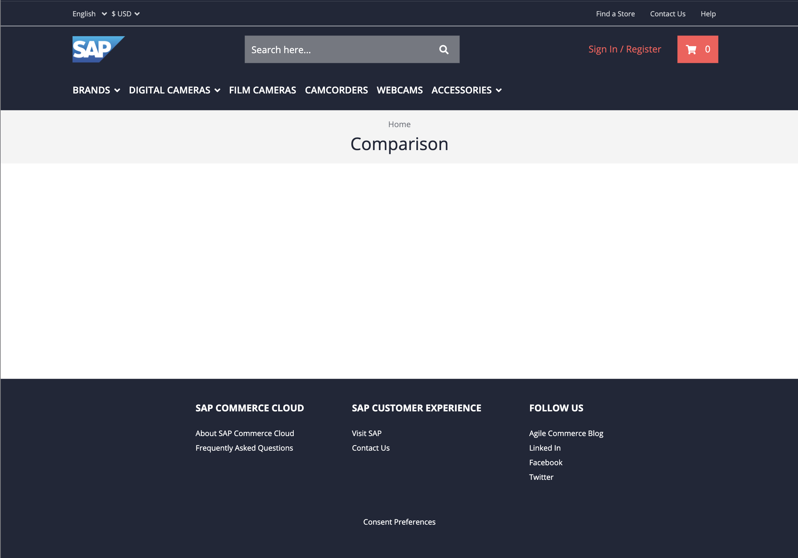
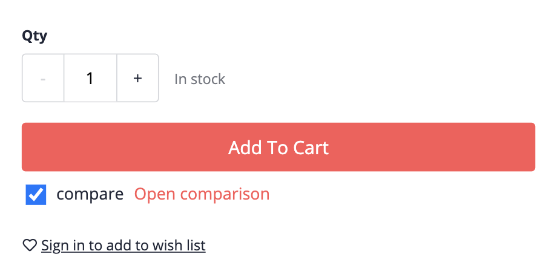

# Exercise 4 - Comparison Page

In this exercise, you will create product comparison page. You'll learn the basics of the Spartacus routing system, that is build on top of the Angular router.

## Exercise 4.1 Setup the CMS Comparison Content Page

Each page in a Spartacus storefront is (by default) driven by the page structure provided by the CMS API. The structure contains the header and footer content as well as the actual page content.
To render the comparison page in Spartacus, we like to follow this approach. Therefor, we must introduce a new page in the CMS.

If you're using the public backend, you actually won't need to do this, as we've been doing this as a preparation of this course. If you are using a custom backend (i.e. running SAP Commerce on you local machine), you can either create the page manually in SmartEdit or Backoffice, or use an example [ImpEx script](./comparison-page.impex) to generate the page.

It is important to understand that the `label` property of the new page will be used when we link to the page. We have set the page label to `/comparison`, so that URL to the product comparison page becomes http://localhost:4200/comparison (note that some _route parameters_ are generated by Spartacus in this URL).

You are now able to visit the comparison page, but it will be empty. We have not yet added any content which is why you will only see the header and footer. The header and footer components are derived from the cms page template.



## Exercise 4.2 Add a link to the comparison page

We will now add a link in the product selection to allow direction navigation to the comparison page when the product is selected.

We'll add the link to the `comparison-selection.component.html` file that we created in exercise 2. We'd add the link only if the product is selected:

```html
<ng-container *ngIf="state$ | async as state">
  ...
  <a *ngIf="state.selected" routerLink="/comparison"> Open comparison </a>
</ng-container>
```

To ensure that the link is using the Angular router, you must import the `RouterModule` in the `ComparisonSelectionModule`:

```ts
@NgModule({
  imports: [CommonModule, RouterModule],
  declarations: [ComparisonSelectionComponent],
})
export class ComparisonSelectionModule {}
```

Once you've added those pieces, you should be able link to the page in the UI:

{width=300px}

## Summary

You've now implemented the link to the (empty) comparison page. We're now ready to implement the actual comparison table.

If you like to validate your implementation, you can find the (actual implementation of the component]https://github.com/SAP-samples/teched2020-CX260/tree/exercises/4-comparison-page/sample-storefront/src/app/product-comparison/comparison-selection) in the sample code.

💡 If you haven't done already, it's a good time again to commit your changes.

---

Continue to [Exercise 5 - Comparison Table Component ](../exercise-5/README.md)
