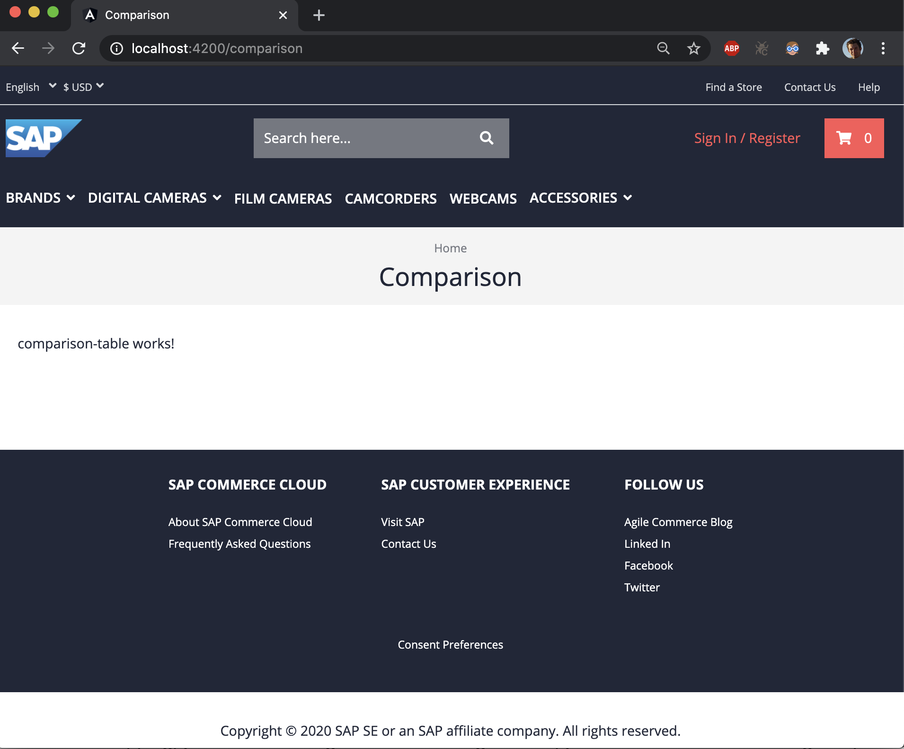

# Exercise 5 - Product Comparison Table

In this exercise, you will add the basic comparison table component to the comparison page.

## Exercise 5.1 Scaffolding comparison table

We start generating the scaffolding code for the comparison table. We like to create a new component and wrap it inside it's own module. We need to execute the following commands in a terminal:

```sh
# generate comparison table module
ng g m product-comparison/comparison-table
# generate comparison table component
ng g c product-comparison/comparison-table
# generate comparison service
ng g s product-comparison/product-comparison
```

To make the newly created comparison table component part of you application, we import it into the `ProductComparisonModule` that we created in exercise 2.

```ts
@NgModule({
  imports: [ComparisonSelectionModule, ComparisonTableModule],
  providers: [
      ...
  ],
})
export class ProductComparisonModule {}
```

## Exercise 5.2 Add static CMS content

In this exercise, we add the new comparison table component to the CMS page structure. While we could do this in the actual CMS, in this exercise we're providing a static CMS structure, _on top of_ the structure that is fetched from the backend CMS api.

Spartacus 3.0 offers a convenient function for this (if you're using a previous version, you can leverage the utility functions provided in the source).

You can add the following provider function to the list of providers in the `ProductComparisonModule`.

```ts
@NgModule({
    providers: [
        provideCmsStructure({
            pageTemplate: 'ContentPage1Template',
            pageSlotPosition: 'Section2A',
            componentId: 'ProductComparisonTable'
        }),
    ]
export class ProductComparisonModule {}
```

The static CMS structure adds the `ProductComparisonTable` to the page template `ContentPage1Template`, in the page slot `Section2A`. While rendering the comparison page, Spartacus will try to render the `ProductComparisonTable`. If you open the comparison page, you'll not yet see any changes, but you should find a warning logged in the console, where Spartacus tells you that it can't find the actual implementation of the cms component.

```
No component implementation found for the CMS component type 'ProductComparisonTable'.
Make sure you implement a component and register it in the mapper.
```

In order to fix this, we need to configure a mapping for the CMS component. The mapping is provided to the configuration, using the `provideConfig` function (from `@spartacus/core`).

You can add the config to the `ComparisonTableModule`:

```ts
@NgModule({
  providers: [
    provideConfig({
      cmsComponents: {
        ProductComparisonTable: {
          component: ComparisonTableComponent,
        },
      },
    } as CmsConfig),
  ],
})
export class ComparisonTableModule {}
```

Now that you've added the mapping, you should no longer see the warning. Instead, you should see the scaffolding component text: "comparison-table works!", which was generated by the CLI in exercise 5.1.



## Summary

You've now added a new component to the comparison page. We're now ready to implement more comparison table header.

If you like to validate your implementation, you can find the [actual implementation of the component](https://github.com/SAP-samples/teched2020-CX260/tree/exercises/5-comparison-table-component/sample-storefront/src/app/product-comparison) in the sample code.

💡 If you haven't done already, it's a good time again to commit your changes.

---

Continue to [Exercise 6 - Product Comparison Header ](../exercise-6/README.md)
