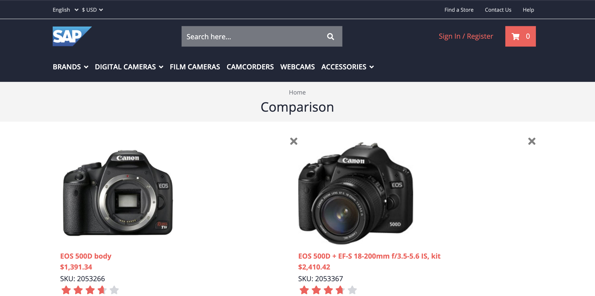

# Exercise 6 - Product Comparison Header

In this exercise, you will implement the header of comparison table. The header contains some high-level product information, such as the main image, name and price.



## Exercise 6.1 Code scaffolding

Let's start generating the header component in it's own module:

```sh
ng g m product-comparison/comparison-header
ng g c product-comparison/comparison-header
```

We're going to use a number of Spartacus components in the header module, which is why we isolate the component in its own module. You should add the following modules to the imports in the generated `ComparisonHeaderModule`:

- `RouterModule` from `@angular/router`
- `UrlModule` from `@spartacus/core`
- `IconModule` and `MediaModule` from '@spartacus/storefront'

The modules export various components and directives that we leverage in the header component.

## Exercise 6.2 Implement component logic

We can now implement our component logic. We delegate most of the logic to the `ProductComparisonService`. The [implementation of this service](https://github.com/SAP-samples/teched2020-CX260/blob/exercises/6-comparison-header/sample-storefront/src/app/product-comparison/product-comparison.service.ts) can be found in the sample code. Given that's a fair amount of code, we're not going over it line by line. We've however added some inline documentation for you to understand what's going on.

Let's leverage the `ProductComparisonService` in the new header component. We bring in the selected products to the header component and reuse the toggle method that we've added in exercise 3.1.

```ts
export class ComparisonHeaderComponent {
  constructor(private comparisonService: ProductComparisonService) {}

  products$ = this.comparisonService.getList([ProductScope.DETAILS]);

  remove(code: string): void {
    this.comparisonService.toggle(code);
  }
}
```

## Exercise 6.3 Implement view logic

We're going to observe the list of selected products (`products$`) and render the product image, name and price. If there's no single product selected, we render an alternative text (templateRef `#empty`).

```html
<ng-container *ngIf="products$ | async as products;else empty">
  <thead>
    <th></th>
    <th *ngFor="let product of products">
      <button
        (click)="remove(product.code)"
        class="close"
        cxIcon="CLOSE"
      ></button>
      <a [routerLink]="{ cxRoute: 'product', params: product } | cxUrl">
        <cx-media [container]="product.images?.PRIMARY"></cx-media>
        <div>{{ product.name }}</div>
        <div>{{ product.price?.formattedValue }}</div>
      </a>
    </th>
  </thead>
</ng-container>
<ng-template #empty> No products to compare.</ng-template>
```

There might a few new gotchas for you with this implementation

- we're using the `cxIcon` directive to add an icon from [the icon library](https://sap.github.io/spartacus-docs/icon-library/).
- we're using the `cxRoute` to ensure that the link to the product page is based on [configurable routing](https://sap.github.io/spartacus-docs/configurable-routing/)
- we're using the `cx-media` component to render an (optimized image from the product)[https://sap.github.io/spartacus-docs/media-component/]

We're adding a few style rules to the scss file:

```scss
:host {
  display: contents;
}
a {
  display: flex;
  flex-direction: column;
}

cx-media {
  width: 50%;
}
```

Additionally, you might want to add the star-rating component. The star rating module should be imported, so that you can use the component:

```html
<cx-star-rating [rating]="product.averageRating"></cx-star-rating>
```

## Exercise 6.4 Add header

Now that we've implemented the header logic, we must add it to the comparison table component. This requires 2 steps:

1. Export the `ComparisonHeaderComponent` in the `ComparisonHeaderModule`, so that we can _select_ it outside the module.

   ```ts
   @NgModule({
     ...
     exports: [ComparisonHeaderComponent],
   })
   export class ComparisonHeaderModule {}
   ```

2. Import the `ComparisonHeaderModule` in the `ComparisonTableModule` and add the `app-comparison-header` to the `ComparisonTableComponent`:

   ```html
   <table>
     <app-comparison-header></app-comparison-header>
   </table>
   ```

## Summary

Now that you've added the header to the `ComparisonTableComponent`, you should be able to see the selected products on the comparison page.

We will implement more comparison attributes in the next exercise.

If you like to validate your implementation, you can find the [actual implementation of the header component](https://github.com/SAP-samples/teched2020-CX260/tree/exercises/6-comparison-header/sample-storefront/src/app/product-comparison) in the sample code.

💡 If you haven't done already, it's a good time again to commit your changes.

---

Continue to [Exercise 7 - Compare product features](../exercise-7/README.md)
