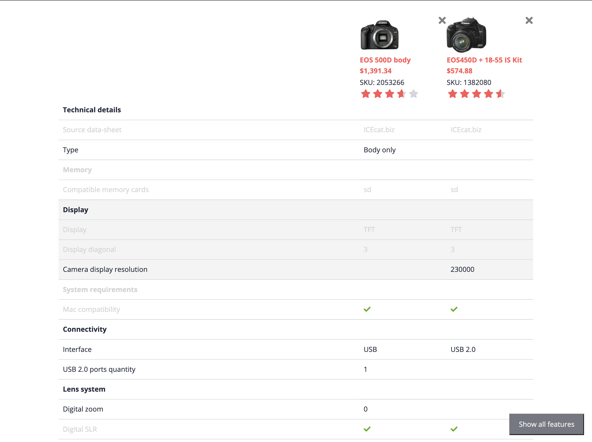

# Exercise 7 - Comparison Features

In this exercise, you will implement the meaty part of the product comparison, the features. This is based on the product features (aka classifications). This requires some comparison logic, as we need to group features and be able to indicate whether the feature values are equal cross products. We'll then use the logic in the view logic to conveniently show/hide equal values, so that the end user can focus on the differences.

## Exercise 7.1 Code scaffolding and importing

We're implementing the comparison features in a separate module, component and service. Let's do some more code scaffolding:

```sh

# generate comparison features module
ng g m product-comparison/comparison-features
# generate comparison features component
ng g c product-comparison/comparison-features
# generate comparison features service
ng g s product-comparison/comparison-features/comparison-features
# generate comparison features interface
ng g i product-comparison/comparison-features/model
```

We're going to use a the `IconModule` again as well the `FormsModule` (`@angular/forms`), so let's import those in the generated `ComparisonFeaturesModule`. We also need to export the generated the `ComparisonFeaturesComponent` from it's module, so that we can use it in the `ComparisonTableModule`. Let's import the module and use it in the table component next to the header component from the previous exercise:

```html
<table *ngIf="products$ | async as products; else empty">
  <app-comparison-header></app-comparison-header>
  <app-comparison-features></app-comparison-features>
</table>
```

You should already see the new features component appearing in the storefront, it should show the scaffolded text "comparison-features works!".

## Exercise 7.2 ComparisonFeaturesService

The implementation of the `ComparisonFeaturesService` is fairly complex. We're not going over this implementation in detail, as there's nothing Spartacus specific to it. You can copy it from the provided source, and read through the inline comments if you like to understand how it works. A few gotchas on this implementation:

- We're comparing the products by product feature groups (Classifications), feature (Classification Features) and feature values.
- We've introduced a few types to improve type safety in the implementation
- If you're familiar with the SAP commerce classification system, you will better understand the data model
- We compare the the actual values, and generate a single string value to show in the UI
- We resolve the value type, so that we can show various content in the UI (i.e. boolean checkbox)
- We resolve whether values are equal, so that we can hide those values in the UI
- We've introduce a `hideEqual` flag on the service, to control wether all features should be shown, or only the once that differ. While the state of the `hideEqual` flag is globally persisted over the session, you could add this to the selection state, so that it will remain cross sessions.

## Exercise 7.3 Implement comparison component (basic)

Similar to the comparison header, we're going to leverage the feature service in the component. The only difference this time around is that we require the `ATTRIBUTES` scope. The list of products will be used to build the comparison features using the `comparisonFeaturesService.build()` method.

```ts
export class ComparisonFeaturesComponent {
  constructor(
    private comparisonService: ProductComparisonService,
    private comparisonFeaturesService: ComparisonFeaturesService
  ) {}

  products$ = this.comparisonService.getList([ProductScope.ATTRIBUTES])

  list$ = this.products$.pipe(
    map((products) => this.comparisonFeaturesService.build(products))
  )
}
```

With the control logic in place, you should already be able to show the features in the UI, by using the following snipped. Remember that you won't see all features, as the `hideEqual` flag is set to true by default.

```html
<ng-container *ngIf="products$ | async as products">
  <tbody *ngFor="let category of list$ | async">
    <tr>
      <th [attr.colSpan]="products.length + 1">{{ category.name }}</th>
    </tr>
    <tr *ngFor="let property of category.properties">
      <td>{{ property.name }}</td>
      <td *ngFor="let product of products">
        <ng-container *ngIf="property.values.get(product.code) as value">
          {{ value }}
        </ng-container>
      </td>
    </tr>
  </tbody>
</ng-container>
```

A bit of styling would be required to improve the UI at this point in time. You add the following styles to the component scss file.

```scss
:host {
  // ensure to not let the host element influence the table flow
  display: contents;
}

tbody {
  transition: background-color 0.3s;
  &:hover {
    background-color: var(--cx-color-background);
  }
  tr {
    border-bottom: solid 1px var(--cx-color-light);
  }
}

tr {
  // keep the text in the first column together
  th,
  td {
    padding: 10px;
    &:not(:first-child) {
      width: 200px;
    }
    &:first-child {
      white-space: nowrap;
    }
  }
}
```


## Exercise 7.4 Implement comparison component (advanced)

We'll further enhance the basic implementation of the comparison component:

- render a `check` icon for boolean values
- render rows with equal values in an alternative so that differences are better visible
- show/hide rows with equal values

### Render check icon

The comparison data that we've build in the `ComparisonFeaturesService` has provided a value type per feature property. This type is either string or boolean. We'll use this type in a new controller method to indicate whether we can render the actual property value:

```ts
hasBoolValue(property: ProductComparisonProperty, value: string): string {
    if (property.type === ComparisonFeatureType.BOOL && !!value) {
      return value === 'true' ? 'ACTIVE' : 'CLOSE';
    }
}
```

We'll use this method to indicate whether to render the value or an icon:

```html
<ng-container *ngIf="property.values.get(product.code) as value">
  <cx-icon
    *ngIf="hasBoolValue(property, value) as icon; else text"
    [type]="icon"
    [class.truthy]="value === 'true'"
  ></cx-icon>
  <ng-template #text>{{ value || "–" }}</ng-template>
</ng-container>
```

To highlight the differences better, we add a little styling to color the icon:

```scss
cx-icon {
  &.truthy {
    color: var(--cx-color-success);
  }
  &:not(.truthy) {
    color: var(--cx-color-danger);
  }
}
```

### Alternative color for equal values

To increase the comparison view, we'll highlight the differences in the comparison table. We do this by introducing a new css class `is-equal` for both the table and table rows:

```html
 <tbody
    *ngFor="let category of list$ | async"
    [class.is-equal]="hasComparableProperties(category)"
>
    ...
    <tr
      *ngFor="let property of category.properties"
      [class.is-equal]="property.isEqual"
    >
    ...
    </td>
</tbody>
```

The feature property already has a notion of the `isEqual` property, but for the feature category (tbody) we must calculate this:

```ts
hasComparableProperties(category: ProductComparisonCategory): boolean {
    let equalProps = 0;
    category?.properties?.forEach((element) => {
      if (element.isEqual) {
        equalProps++;
      }
    });
    return equalProps === category?.properties?.length;
}
```

### Hide comparable properties

Last but not least, we introduce a toggle to completely hide equal properties from the comparison table. This will help a lot to understand the differences, especially when the list of differences is huge.

We introduce a checkbox in the UI that the user can use to toggle the visibility:

```html
<button
  *ngIf="products.length > 1"
  (click)="hideEqual = !hideEqual"
  [innerText]="hideEqual ? 'Show differences only' : 'Show all features'"
></button>
```

We _bind_ the `hideEqual` property to the (singleton) `ProductComparisonService`, so that the user driven selection remains while navigating through the storefront. We also bind the property to a css class, using the `@HostBinding` syntax.

```ts
@HostBinding('class.hide-equal')
set hideEqual(value: boolean) {
    this.comparisonFeaturesService.hideEqual = value;
}
get hideEqual(): boolean {
    return this.comparisonFeaturesService.hideEqual;
}
```

Now that toggling the css class `hide-equal` is in place, we can simple hide the table body and rows, by adding the following css rules:

```scss
:host {
  display: contents;
  &.hide-equal .is-equal {
    display: none;
  }
}
```

We finalize this exercise with a few style rules to move the the toggle button in a fixed position on the screen.

```scss
button {
  position: fixed;
  bottom: 20px;
  right: 20px;
  background: var(--cx-color-secondary);
  color: var(--cx-color-background);
  padding: 10px 20px;
}
```

That's it. You should now have the following experience:



## Summary

We hope you enjoyed the exercises!
